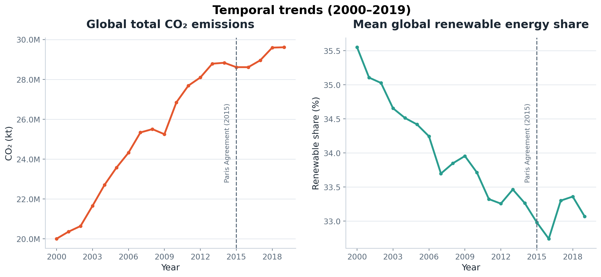
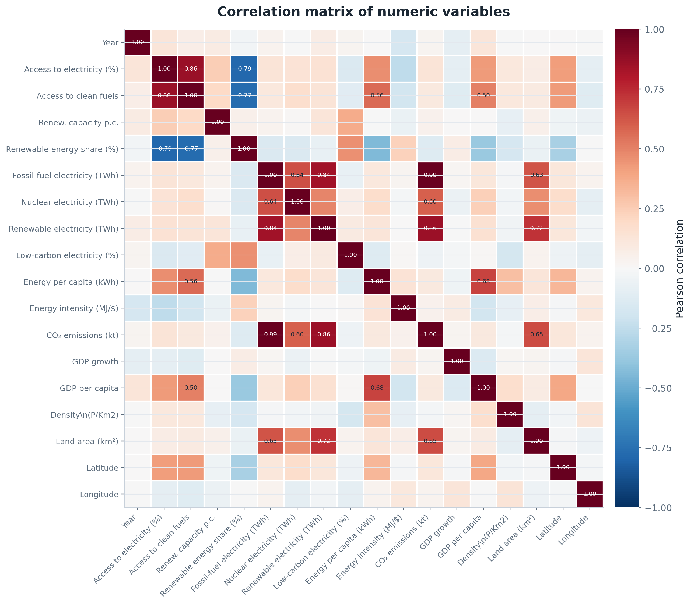
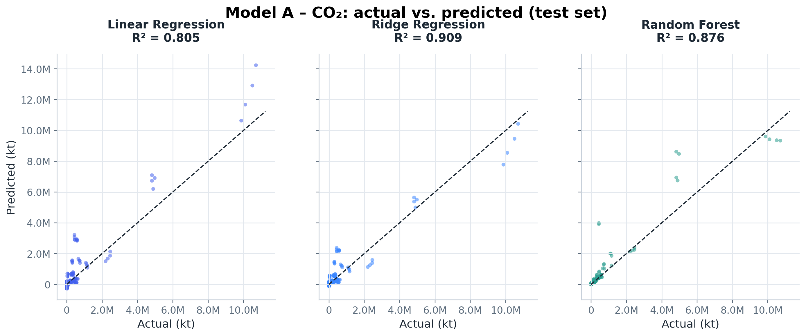
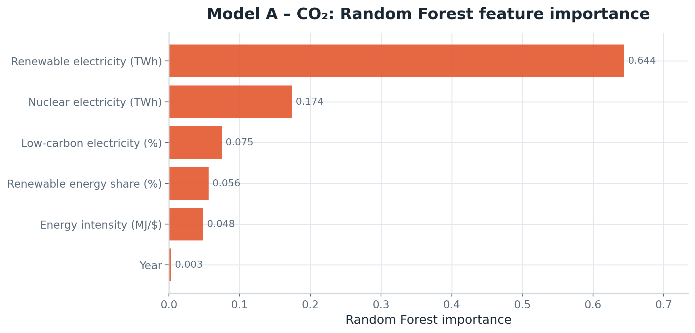
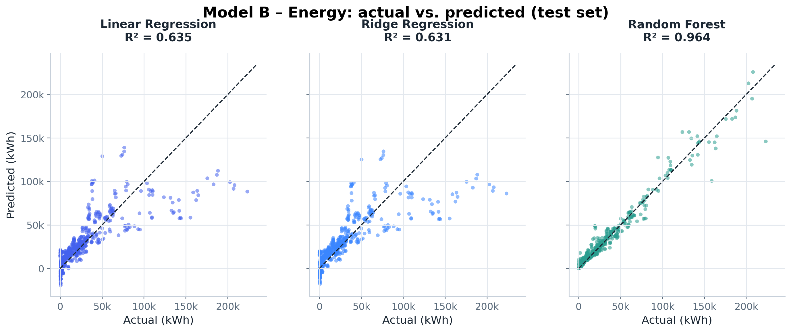
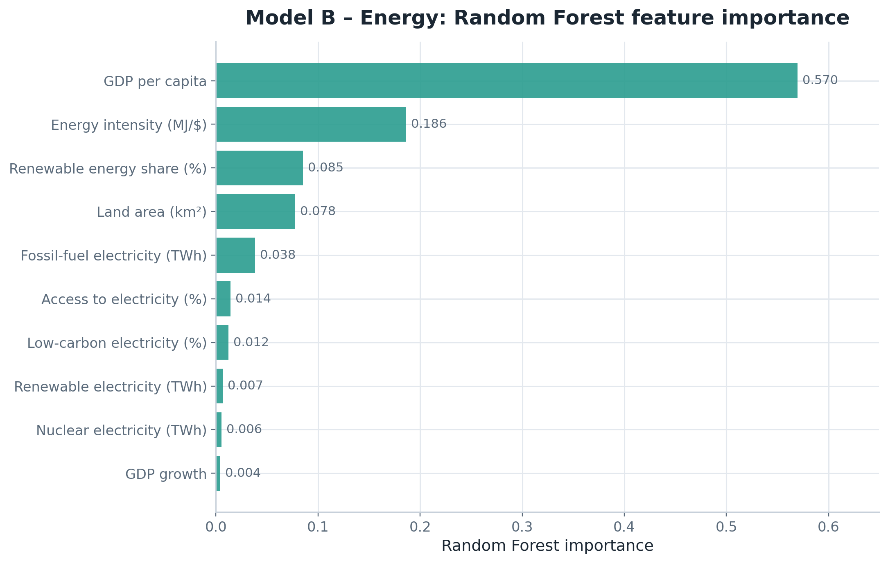

# Machine Learning for Global Energy Sustainability


Machine Learning project exploring global energy consumption and CO₂ emissions across **176 countries** between **2000 and 2019**.

Using public datasets, this project combines exploratory data analysis (EDA), statistical diagnostics and predictive modelling to identify the key drivers of carbon emissions and primary energy consumption.

---

# 🎓 About this Project

This repository is based on my Bachelor's Thesis completed as part of the Mechanical Engineering degree at the **University of Malaga (Spain)**.

The thesis was awarded a final grade of **9.0/10 (Excellent)** by a faculty examination committee composed of PhD academics.

Rather than simply uploading the thesis document, this repository restructures the work into a professional, reproducible and continuously evolving Data Science project following software engineering and open-source best practices. 

---

# 📌 Highlights

- 🌍 Analysis of global energy and sustainability trends across **176 countries (2000–2019)**
- 🤖 Development of two supervised Machine Learning models for CO₂ emissions and energy consumption prediction
- 📈 Best predictive performance achieved with **Random Forest (R² = 0.963)** and **Ridge Regression (R² = 0.91)**
- 🔬 End-to-end workflow including EDA, statistical diagnostics and model evaluation
- 🌱 Focus on sustainability, energy transition and climate analytics

---

# 📖 Project Overview

The global energy transition is one of today's most important engineering and policy challenges. Governments and organizations increasingly rely on data-driven approaches to understand energy demand, renewable adoption and carbon emissions.

This project applies Data Science and Machine Learning techniques to analyze global energy indicators and build predictive models capable of estimating:

- Country-level CO₂ emissions
- Primary energy consumption per capita

Beyond predictive performance, the project emphasizes data understanding, statistical validation and model interpretability.

---

# 🎯 Business Problem

This project addresses two practical questions:

### Model A

**Can a country's CO₂ emissions be accurately predicted using its economic and energy indicators?**

### Model B

**Which variables best explain primary energy consumption per capita across countries?**

Answering these questions can support:

- Energy policy analysis
- Sustainability planning
- Climate risk assessment
- Energy transition strategies
- Environmental decision-making

---

# 📊 Dataset

| Attribute | Value |
|-----------|-------|
| Primary dataset | Global Data on Sustainable Energy |
| Source | Kaggle |
| Coverage | 176 countries |
| Analysis period | 2000–2019 |
| Records | ~3,600 |
| Variables | 21 |
| Secondary dataset | Our World in Data (OWID) |

The dataset contains economic, demographic and energy-related indicators, including:

- GDP per capita
- Fossil fuel, Renewable and Nuclear electricity generation
- Energy intensity
- Access to electricity
- Primary energy consumption

---

# 🛠️ Tech Stack

| Category | Technologies |
|-----------|--------------|
| Programming | Python |
| Data Analysis | pandas · NumPy |
| Visualization | matplotlib · seaborn |
| Machine Learning | scikit-learn |
| Statistical Analysis | statsmodels |
| Development Environment | Jupyter Notebook · Google Colab |

---

# 🔬 Methodology

The project follows a complete end-to-end Data Science workflow.

## 1. Data Preparation

- Data inspection
- Missing value treatment
- Variable renaming
- Consistency checks

## 2. Exploratory Data Analysis

- Univariate analysis
- Outlier detection
- Correlation analysis
- Multicollinearity analysis (VIF)

## 3. Feature Engineering

- Feature selection
- Standardization using StandardScaler

## 4. Machine Learning Models
  
### Model A — CO₂ Emissions Prediction

Algorithms evaluated:

- Linear Regression
- Ridge Regression
- Random Forest

**Selected model:** Ridge Regression

---

### Model B — Primary Energy Consumption Prediction

Algorithms evaluated:

- Linear Regression
- Ridge Regression
- Random Forest

**Selected model:** Random Forest

---

## 5. Model Evaluation

Models were assessed using:

- R² Score
- Mean Absolute Error (MAE)
- Root Mean Squared Error (RMSE)
- Breusch–Pagan test
- Durbin–Watson statistic

---

## 6. External Validation

An external validation attempt was conducted using the **Our World in Data** dataset.

Although direct validation was ultimately not feasible due to methodological differences between datasets (including GDP definitions and energy intensity metrics), this analysis became an additional methodological contribution highlighting the importance of data compatibility in real-world Machine Learning projects.

---

# 📈 Results

| Model | Target Variable | Best Algorithm | Test R² |
|--------|-----------------|----------------|----------|
| Model A | CO₂ Emissions | Ridge Regression | **0.91** |
| Model B | Energy Consumption per Capita | Random Forest | **0.963** |

## Main Findings

- Fossil-fuel electricity generation is the strongest predictor of CO₂ emissions.
- GDP per capita plays a major role in explaining energy consumption.
- Random Forest captures nonlinear relationships more effectively than linear models.
- Dataset consistency is critical when performing external validation.

---

# 📂 Repository Structure

```text
energy-sustainability-ml/
│
├── README.md                    # Project overview and documentation
├── LICENSE                      # MIT License
├── requirements.txt             # Python dependencies
├── .gitignore                   # Files ignored by Git
│
├── notebooks/
│   ├── README.md
│   ├── energy_sustainability_ml.ipynb
│   └── generate_figures.ipynb
│
├── images/
│   ├── README.md
│   ├── 01_dist_co2.png
│   ├── ...
│   └── 13_modelB_energy_actual_vs_pred.png
│
├── docs/
│   ├── README.md
│   └── energy_sustainability_thesis.pdf
│
└── data/
    └── README.md
```
---

# 📷 Project Preview

The following figures provide a visual overview of the exploratory data analysis and the Machine Learning models developed in this project.

### Global Energy Trends

<p align="center">
  
</p>

---

### Correlation Matrix

<p align="center">
  
</p>

---

### CO₂ Emissions Prediction (Model A)

*Actual vs Predicted values using Ridge Regression.*

<p align="center">
  
</p>

---

### Feature Importance — Model A

*Relative importance of the predictors used to estimate CO₂ emissions.*

<p align="center">
  
</p>

---

### Primary Energy Consumption Prediction (Model B)

*Actual vs Predicted values using Random Forest.*

<p align="center">
  
</p>

---

### Feature Importance — Model B

*Relative importance of the predictors used to estimate primary energy consumption per capita.*

<p align="center">
  
</p>

---

For the complete set of visualizations generated throughout the project, see the [`images/`](images/) directory.

---

# 💼 Potential Applications

The methodology presented in this project can be applied to:

- Sustainability Analytics
- ESG Reporting (Environmental, Social and Governance)
- Energy Policy
- Environmental Consulting
- Climate Risk Assessment
- Public Sector Decision Support

---

# 🔎 Methodological Considerations

- The analysis is performed at the country level, masking differences between sectors such as industry, transport and residential consumption.
- The primary dataset does not include potentially relevant variables such as energy prices, installed renewable capacity or infrastructure investment.
- The study covers the period **2000–2019**, excluding the effects of the COVID-19 pandemic and subsequent changes in global energy markets.
- Hyperparameter optimization was intentionally limited, prioritizing methodological comparison and model interpretability.
- External validation was not completed because the Kaggle and Our World in Data datasets use different definitions and scales for key variablese.

---

# 🔮 Future Improvements

Developments include:

- [ ] Evaluate the trained models on harmonized external datasets to assess their robustness and generalization across different data sources.
- [ ] Interactive dashboards and Plotly visualizations
- [ ] Updated post-2020 dataset
- [ ] Expanded feature engineering
- [ ] Further hyperparameter optimization, especially for Random Forest

---

# 👤 Author

**Juan Jesús Gómez Ortiz**

Mechanical Engineer | Data Science & Machine Learning

📍 Madrid, Spain

- GitHub: https://github.com/jj-gomez-ortiz
- LinkedIn: https://www.linkedin.com/in/jj-gomez-ortiz/

---

# 📄 License

This project is licensed under the MIT License.

See the `LICENSE` file for more information.
